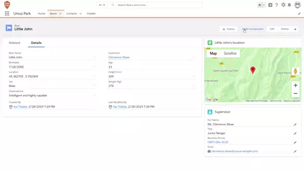

# Simple-Quick-Action-Lighting-Web-Component
Launch a Lightning Web Component from a Quick Action.



Think this should be easier? Upvote this Idea on IdeaExchange: 
https://success.salesforce.com/ideaView?id=0873A000000TzwnQAC

## Installation Instructions

## Installing Quick Action LWC using a Scratch Org

1. Set up your environment. Follow the steps in the [Quick Start: Lightning Web Components](https://trailhead.salesforce.com/content/learn/projects/quick-start-lightning-web-components/) Trailhead project. The steps include:

-   Enable Dev Hub in your Trailhead Playground
-   Install Salesforce CLI
-   Install Visual Studio Code
-   Install the Visual Studio Code Salesforce extensions, including the Lightning Web Components extension

2. If you haven't already done so, authenticate with your hub org and provide it with an alias (**myhuborg** in the command below):

```
sfdx force:auth:web:login -d -a myhuborg
```

3. Clone the repo:

```
git clone https://github.com/1ktribble/Simple-Quick-Action-Lighting-Web-Component
cd lwc-recipes
```

4. Create a scratch org and provide it with an alias (**lwc-qa** in the command below):

```
sfdx force:org:create -s -f config/project-scratch-def.json -a lwc-qa
```

5. Push the app to your scratch org:

```
sfdx force:source:push
```

6. Load sample data:

```
sfdx force:data:tree:import --plan ./data/data-plan.json
```

7. Open the scratch org:

```
sfdx force:org:open
```

## Manual Steps

8. Open either the **Contact** or **Bear__c** object settings. 

9. Navigate to the Buttons, Links and Actions Tab. Create a **New Action**.

10. For action type, select **Lightning Component**. Under Lightning Component, select the Aura component you used to encapsulate the LWC.

11. Save.

12. Pull the changes back into your local project.

```
sfdx force:source:pull
```